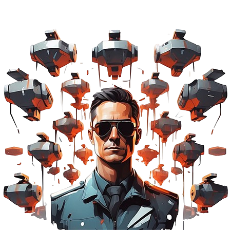

<h2 align="center">Captain</h2>

  
  
  

 Python framework boilerplate that allows the creation of agents to perform various tasks

 

<h2> Documentation is available at <a href="https://itskovacs.github.io/captain">https://itskovacs.github.io/captain</a></h2>

